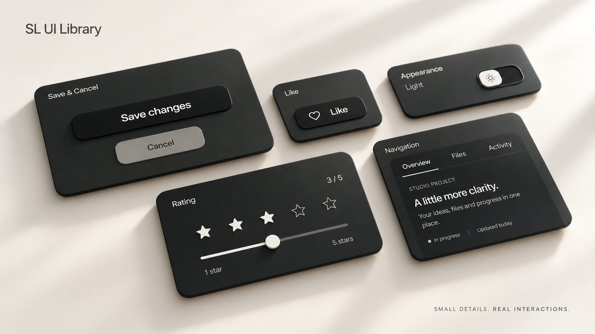
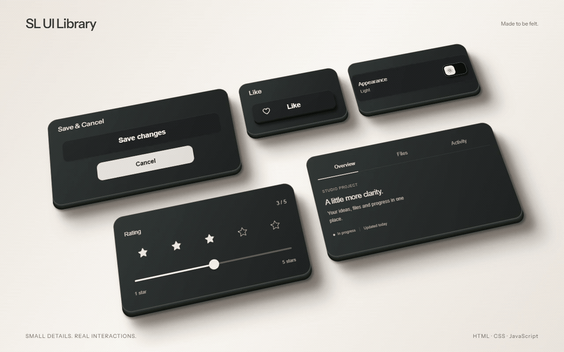
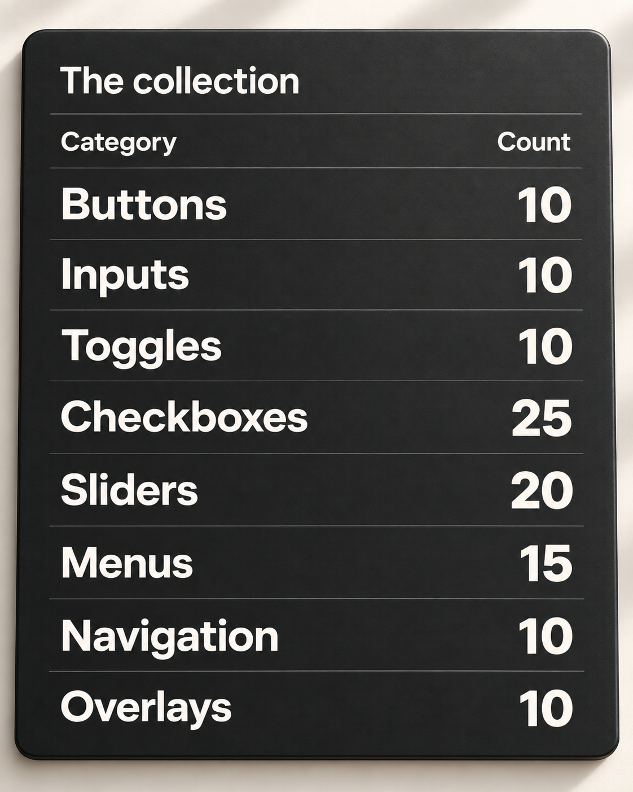
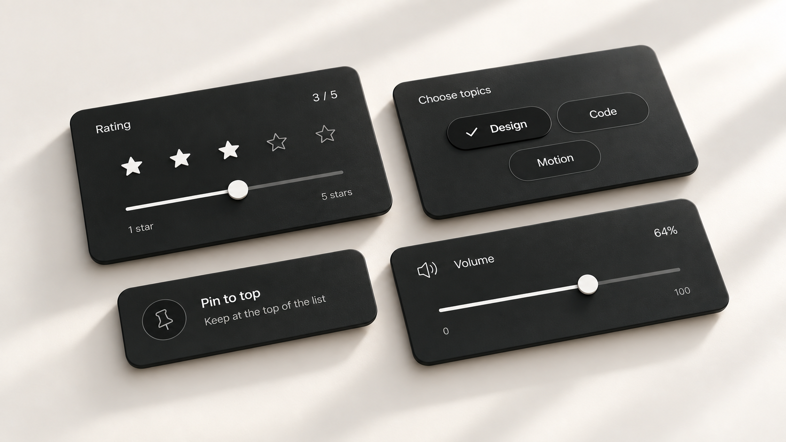

# SL UI Library

An AI plugin for finding and integrating UI components, with a browsable HTML, CSS and JavaScript library.



**110 interactive components** in HTML, CSS and JavaScript. No runtime dependencies, remote fonts or stock icon libraries. Preview components and download their source files. The plugin helps a coding agent find and integrate components.

[Open the library](https://sltowl.github.io/sl-ui-library/) · [Install the plugin](#plugin-installation) · [Components](#components) · [Integration guide](docs/integration.md) · [Quality notes](QA.md)

## Component demos

[](https://sltowl.github.io/sl-ui-library/media/studio-motion.mp4)

The demo shows saving, liking, theme switching, rating and tab navigation. It uses the library's components with CSS 3D styling. No cursor.

[Watch / download MP4](https://sltowl.github.io/sl-ui-library/media/studio-motion.mp4) · [WebM](https://sltowl.github.io/sl-ui-library/media/studio-motion.webm) · [Live 3D scene](https://sltowl.github.io/sl-ui-library/studio-motion.html) · [Interactive showcase](https://sltowl.github.io/sl-ui-library/showcase.html)

Studio photography is generated artwork; the film uses library components with CSS 3D styling.

## Components

<p align="center"></p>


110 components, 112 export variants. Save & Cancel is available together or separately. Feedback and Data display are reserved for later versions: **Nothing added yet**.

## Plugin installation

The plugin includes the catalog, component source and a skill for selecting components and adapting their colors. Install it in your AI application, then describe the interface you need.

[Download the plugin ZIP](https://sltowl.github.io/sl-ui-library/downloads/sl-ui-library-plugin.zip) · [Platform setup and availability](docs/agents.md)

### Claude

Open **Customize → Plugins** and upload the plugin ZIP using the custom-plugin option. Enable the plugin, then use its **use-sl-ui** skill or ask for a component in normal language. This is a skills-based plugin, not a remote connector. [Claude's installation guide](https://support.claude.com/en/articles/13837440-use-plugins-in-claude).

### ChatGPT

For local testing in **ChatGPT desktop Work / Codex**, open the downloaded repository as a project, restart the desktop app, then open **Plugins** and install **SL UI Library** from the repository's **Personal** marketplace. Local sources are not the public Plugins Directory and are not available on every ChatGPT surface.

**Public ChatGPT installation is not live yet.** The archive is prepared for a skills-only submission; OpenAI review and publication are still required before we can provide a public Install link. Uploading a ZIP to an ordinary chat is not a plugin installation. [OpenAI's packaging guide](https://developers.openai.com/plugins/build/plugins).

<details>
<summary>Claude Code and Codex CLI</summary>

In Claude Code:

```text
/plugin marketplace add SLtowl/sl-ui-library
/plugin install sl-ui-library@sl-ui-library
```

For Codex CLI only, from a downloaded, reviewed checkout with Node.js 22+:

```sh
node install.mjs
```

That command installs into Codex; it does not install into Claude or ChatGPT on the web.

</details>

The agent runs the source tools in its code-execution environment. Node.js 22+ is needed for the bundled CLI; this is not a terminal command the user needs to run for each button. Availability depends on the host's plugin and code-execution permissions.

Example request:

> Add a project-creation dialog from SL UI Library. Match my app’s midnight-blue palette, keep the soft motion and connect it to my create-project action.

The agent reads the catalog, chooses a component by purpose, retrieves its HTML, CSS and JavaScript, and adapts the colors. Integration and contrast still need verification in your application.

<details>
<summary>Only need one component?</summary>

```sh
node component.mjs like ./my-button
```

This exports one complete example to a new folder. Its parent must exist; existing destinations and symlink parents are refused. Source files are verified before writing.

</details>

The complete initial catalog works offline after installation. Local package tests pass; full in-app installation and prompt-selection checks in Claude and ChatGPT remain separate host acceptance tests. See the [agent guide](docs/agents.md) for setup, palette handling and internals.

### Catalog updates

An opt-in data updater is prepared for the release channel. Once published and enabled by the user, it checks for a newer catalog on use, at most once per day, with an offline fallback. Existing components in your app are never silently replaced. Plugin code and skill updates remain host-managed.

**Update status:** the public update channel is not live. No telemetry is enabled. Owner-only release-download reporting is provided as a local tool, not a tracker; asset downloads are not unique installations. See the [update and metrics details](docs/agents.md).

## Component integration

Each component archive includes HTML, CSS, JavaScript, an integration example and local assets. Its Usage notes describe how to add it to your project and connect action handlers.

Archive, rename and creation demos only change preview state. In production, show success after your own operation succeeds. User-entered names remain literal text, including Unicode; action labels stay English.

## Library website

This repository contains the complete static library. GitHub stores the source; GitHub Pages serves the public website. Visitors to a hosted version will not need terminal commands or Node.js.

The site is published from `public/` by the [Pages workflow](https://github.com/SLtowl/sl-ui-library/actions/workflows/pages.yml). Check its latest deployment before sharing the website; a failed run means the site has not been updated.

<details>
<summary>For developers: run a local copy</summary>

Requires Node.js 22 or newer. From the repository:

```sh
npm start
```

This builds the exports and starts a local server. Open `http://127.0.0.1:4321/` on the same computer. No dependency installation is required. Use HTTP, not a double-clicked HTML file.

</details>

## Repository structure

```text
public/                 Interactive site and component source
  packages/             Self-contained component examples
plugins/sl-ui-library/  Portable plugin, host manifests, skill and source tools
docs/                   Guides, studio photography and film
tests/                  Automated checks
install.mjs             Optional Codex CLI installer
component.mjs           Optional single-component export
```

Edit component sources in `public/packages/` and metadata in `public/catalog-data.js`, then run `npm run build` and `npm run check`. Commit source and tracked generated data together. ZIP exports are regenerated by build/start rather than duplicated in Git history. See [contributing](CONTRIBUTING.md).

## Checks and limitations

- Project-owned SVG icons and bundled fonts.
- Keyboard interaction, visible focus and reduced-motion support.
- Repeated interaction and reset checks.
- Source, ZIP export and agent bundle consistency checks.
- No analytics scripts or tracking pixels.

See [QA evidence and limitations](QA.md). Chrome is the current automated browser target; Firefox, Safari and physical touch devices still need a separate release check.



Cover, collection table and closing image: generated studio artwork. Film: actual controls with a 3D presentation layer. [Media provenance](docs/media.md).

## Release status and licensing

[SLtowl/sl-ui-library](https://github.com/SLtowl/sl-ui-library) is public. The plugin archive and Claude Code repository marketplace are available. A public ChatGPT Plugins Directory listing has not been submitted or approved. No analytics collection is enabled.

No code license has been selected. Public visibility does not grant an open-source license. Instrument Sans includes its OFL license.
